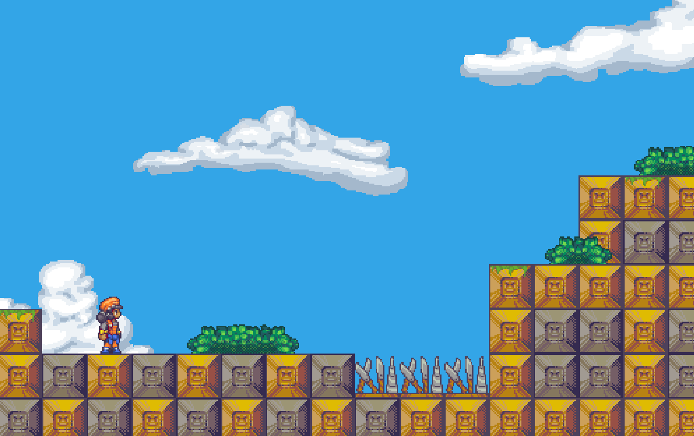

# Phaser Study

Demo: https://jumpjump.netlify.app/

### Install Dependencies

From the project directory run:

`npm install` or `yarn`

## Usage

### Development Server

Starts a development server that will automatically refresh the page as you make changes. Once started, navigate to http://localhost:8080 in your browser.

To start the server run:

`npm run start` or `yarn start`

### Distribution

Bundles and minimises scripts and outputs them along with a copy of the assets/ folder to output directory dist/.

To build for distribution run:

`npm run build` or `yarn build`
